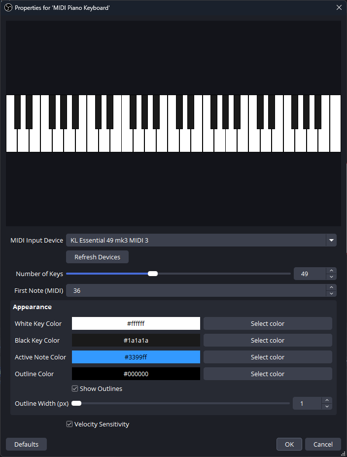

# MIDI Piano Keyboard

An OBS Studio plugin that visualizes MIDI keyboard input as a real-time piano overlay source.

## Features

- Real-time piano key highlighting on MIDI note input
- Configurable number of keys (25–88) and starting note (MIDI 0–108)
- Auto-detect and reconnect to MIDI input devices
- Customizable colors: white keys, black keys, active notes, outlines
- Velocity-sensitive brightness for active notes
- Adjustable outline width
- Russian and English UI localization

## Installation

### Windows
Download the `.exe` installer from [Releases](https://github.com/hack1exe/obs-midikeyboard/releases) and run it. The installer will detect your OBS Studio installation path.

### macOS
Download the `.pkg` installer from [Releases](https://github.com/hack1exe/obs-midikeyboard/releases).

### Linux
Download the `.deb` or `.tar.xz` package from [Releases](https://github.com/hack1exe/obs-midikeyboard/releases).

## Usage

1. Add a new **Source** → **MIDI Piano Keyboard**
2. Select your MIDI device from the dropdown (click **Refresh Devices** if needed)
3. Adjust key range and appearance to your preference
4. Play your MIDI keyboard — the on-screen piano lights up in real-time

## Building from source

See the [OBS Plugin Template Wiki](https://github.com/obsproject/obs-plugintemplate/wiki) for build instructions.
